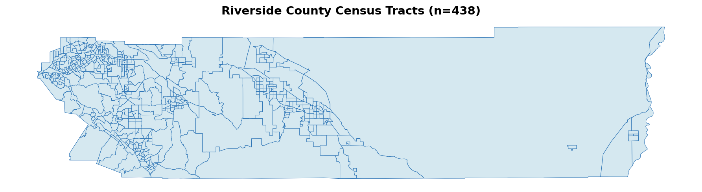
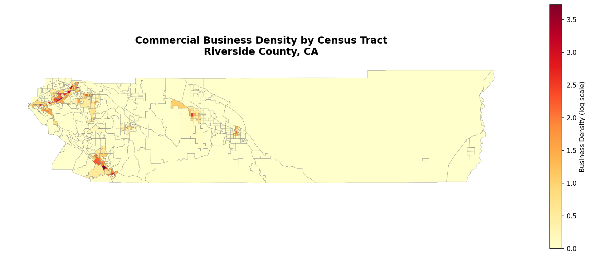
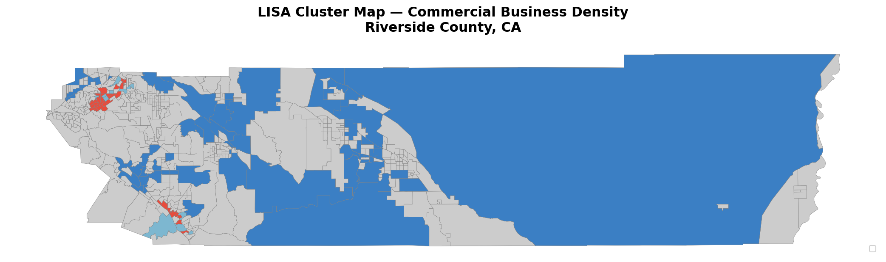
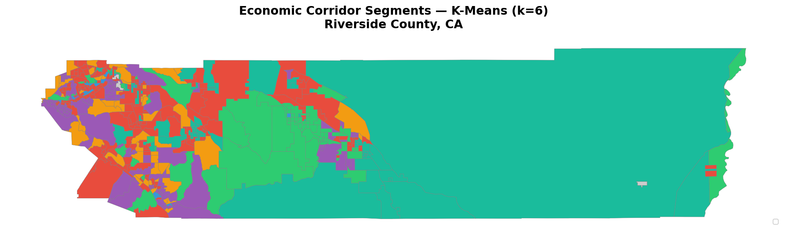
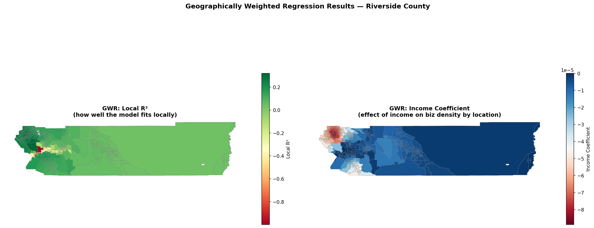

# Riverside County Commercial Opportunity Zone Analysis
### GIS Data Science Portfolio — Project 10

[](https://www.python.org/)
[](https://geopandas.org/)
[](LICENSE)

A full geospatial economic development analysis pipeline identifying high-potential
commercial opportunity zones across Riverside County, CA. Built entirely with free,
open-source tools and publicly available data.

---

## Interactive Map

> 📍 **[View the Live Opportunity Map](https://Suvamp.github.io/riverside-county-economic-opportunity/outputs/riverside_opportunity_map.html)**

The map features three toggleable layers — Opportunity Score choropleth, LISA cluster
overlay, and sampled commercial POI markers — with tract-level popups showing key stats.

---

## Project Overview

| | |
|---|---|
| **Study Area** | Riverside County, California (438 census tracts) |
| **Data Vintage** | Census ACS 5-Year 2022 · OpenStreetMap 2025 · HUD OZ 2024 |
| **Tools** | Python · GeoPandas · OSMnx · Folium · PySAL · mgwr · scikit-learn |
| **Output** | Interactive HTML map · GeoJSON · Top-20 CSV · 6 static maps |

---

## Key Results

- **Moran's I = 0.68** (p < 0.001) — strong positive spatial autocorrelation confirms that commercial activity clusters geographically rather than distributing randomly across the county
- **6 economic corridor types** identified via K-Means clustering: Logistics & Industrial Hubs, Affluent Retail Corridors, Tourist & Hospitality Zones, Low-Density Opportunity Zones, Mixed Urban Core, and Agricultural Service Areas
- **Coachella Valley tracts rank highest** for opportunity score — large populations with rising consumer demand but among the lowest business densities in the county
- **GWR reveals spatial non-stationarity** — the income↔business density relationship is strong in the western corridor (local R² > 0.7) but breaks down in the Coachella Valley (local R² < 0.3), where tourism-driven demand operates independently of local income levels
- **~70% of HUD-designated Opportunity Zone tracts** fall in the top tercile of the data-driven composite score, independently validating the federal designations

---

## Analysis Pipeline

```
Census TIGER          OpenStreetMap           Census ACS
(Tract Boundaries)    (Commercial POIs)       (Demographics)
       │                     │                      │
       └──────────┬──────────┘                      │
                  ▼                                 │
          Spatial Join ◄───────────────────────────┘
          (point-in-polygon)
                  │
                  ▼
        Business Density (POI/km²)
                  │
        ┌─────────┼──────────┐
        ▼         ▼          ▼
   Moran's I   K-Means    Opportunity
   + LISA      (k=6)      Score Index
   Clusters    Segments   (weighted)
        │         │          │
        └─────────┼──────────┘
                  ▼
       Geographically Weighted
         Regression (GWR)
                  │
                  ▼
         Interactive Folium Map
```

---

## Repository Structure

```
riverside-county-economic-opportunity/
│
├── RivCo_Economic_Opportunity.ipynb   ← Main analysis notebook (38 code cells)
├── environment.yml                    ← Conda environment definition
├── SETUP.md                           ← Environment setup instructions
├── README.md
│
├── data/
│   └── raw/
│       └── ca_tracts_2022.zip         ← Census TIGER cartographic boundary file
│
└── outputs/
    ├── 01_tract_boundaries.png        ← Riverside County tract map
    ├── 02_biz_density_choropleth.png  ← Commercial density choropleth
    ├── 03_lisa_cluster_map.png        ← LISA spatial cluster map
    ├── 04_elbow_curve.png             ← K-Means elbow method
    ├── 05_kmeans_corridors.png        ← Economic corridor segments map
    ├── 06_gwr_maps.png                ← GWR local R² and income coefficient maps
    ├── top20_opportunity_tracts.csv   ← Top 20 highest-scoring tracts
    ├── riverside_tracts_full.geojson  ← Full GeoDataFrame export (all metrics)
    └── riverside_opportunity_map.html ← Interactive Folium map (3 layers)
```

---

## Output Maps

| Map | Description |
|-----|-------------|
|  | 438 Riverside County census tracts |
|  | Commercial POI density (log scale) |
|  | Spatial autocorrelation cluster types |
|  | Economic corridor segments (k=6) |
|  | GWR local R² and income coefficients |

---

## Data Sources

| Dataset | Source | Format |
|---------|--------|--------|
| Census Tract Boundaries | [Census TIGER/Line 2022](https://www.census.gov/geographies/mapping-files/time-series/geo/cartographic-boundary.html) | Shapefile |
| ACS 5-Year Estimates | [Census API 2022](https://api.census.gov/data/2022/acs/acs5) | JSON via API |
| Commercial POIs | [OpenStreetMap via OSMnx](https://osmnx.readthedocs.io/) | GeoDataFrame |
| HUD Opportunity Zones | [HUD User](https://hudgis-hud.opendata.arcgis.com/) | CSV |

---

## Environment Setup

See **[SETUP.md](SETUP.md)** for full instructions. Quick start:

```bash
conda env create -f environment.yml
conda activate riverside_econ
python -m ipykernel install --user --name riverside_econ --display-name "Riverside Econ P10 (Python 3.11)"
jupyter lab
```

---

## Industry Relevance

This project demonstrates skills directly applicable to roles in:

- **Regional Planning Agencies** (SCAG, RCTC, WRCOG) — tract-level economic opportunity mapping and spatial clustering used in general plan updates and economic development studies
- **Economic Development Departments** — data-driven identification of underserved commercial corridors, cross-referenced against HUD Opportunity Zone designations
- **PropTech / Site Selection** — GWR-based modeling of income-to-commercial-activity relationships for retail expansion analysis
- **Smart Cities / Civic Tech** — reproducible open-data pipeline publishable as a public-facing interactive map

---

## License

MIT License — see [LICENSE](LICENSE) for details.

---
